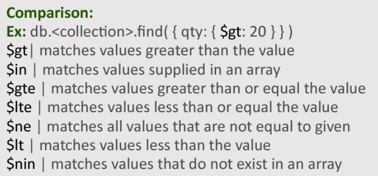
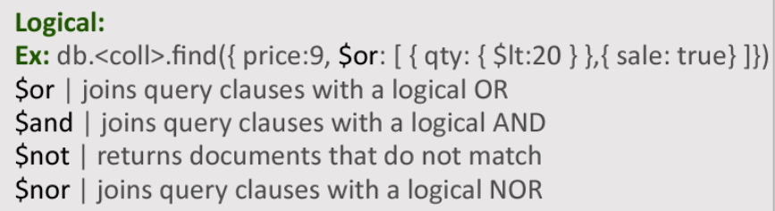

# mongodb-lesson

_n.b. although MongoDB is used mostly in the context of JavaScript and Node.JS servers, the Python library is also good and I've most recently used it in Python and I feel like Python is better known and regarded by a larger number of people, especially among students. But it would not be hard to switch to JavaScript._

So as we all know, normally when we write and run a program all of the variables and objects and whatnot we've created evaporate as soon as it finishes, and the next time we run that program it's completely back to square one. That's why we need to use databases to store our program's thoughts and ideas persistently. A database will receive stuff from our program, hold on to it even when our program's not running, and probably store it in some files somewhere in a very efficiently retrievable-from format, so we have it even after losing power during a once-in-a-century thunderstorm.

There's a language for giving commands to databases called SQL. We won't be using it, but it was really popular for some time, and some people claim they can still hear its voice. Instead we'll be using a NoSQL database; the technical definition of the term NoSQL is, it's a database that doesn't use SQL. [MongoDB is the most popular NoSQL database.](https://survey.stackoverflow.co/2022/#section-most-popular-technologies-databases) It stores data in documents. Documents have other names in other contexts, like "dicts" in pure Python and "objects" in JavaScript, but I'm just going to call them documents here; you will become extremely tired of the word. Documents look like this:

### Document example: data for a person

```json
{
  "name": "Mitch",
  "balance": -10.17,
  "happy": False,
  "brain_cells_gone_forever": 10245
}
```

So this pattern of storing data entries with labels that indicate their meaning is a common one in programming. In fact, you could say that whenever you make a variable in a programming language, you're storing a data entry with a label - the variable name - attached. In the context of a database, though, we're going to go one step further and store multiple documents like this, each with their own value attached to these labels, like for this example each document would have a different value for "name"; MongoDB is set up to store collections of documents, meaning a whole bunch of, for example, people, and there's an obvious use case for a database like this.

This is how you connect to a database that contains Pokemon:

```python
from pprint import pprint  # not a mongodb thing, but useful for displaying documents
from pymongo import MongoClient

client = MongoClient(
    host="mitch.website",
    username="student",
    password="[[[PASSWORD]]]"
)
database = client.pokemon  # get the database called "pokemon" on this server
collection = database.pokedex  # get the collection called "pokedex" in that database
```

And this is how you retrieve the document corresponding to a Pokemon and print it:

```python
pikachu = collection.find_one({"name": "Pikachu"})
pprint(pikachu)
```

So. Do you all see Pikachu?

You've just retrieved a MongoDB document, and it's giving you information about a Pokemon. If you want information about some other Pokemon, feel free to replace "Pikachu" with its name. The data, the variables that we retrieved are inside the document, but we can get them out pretty easily. If you want to see Pikachu's base HP, just do this:

```
pprint(pikachu["HP"])
```

So in MongoDB, you create queries by creating sort of mini-documents that specify what you're looking for, like the one we have here. This was a really really simple one: we had one key and one value; that pair had to be present in a document in the database for it to match. But we can do more subtle things as well; for example, instead of looking for a `"name"` that is `"Pikachu"`, we could look for a `"HP"` that is `greater than 45`. So the first part of requesting that looks pretty familiar:

```python3
good_hp = collection.find_one({"HP":           })
```

But to specify the exact condition we're looking for, we're going to need to express the concept "greater than" and the number "45". We can do that by making another mini-document, with that first thing as the key and the second thing as the value:

```python
good_hp = collection.find_one({ "HP": {"$gt": 45} })
```

So this introduces us to the wonderful world of operators.

Did that work for everyone? It's okay that only one result showed up.

Operators are special labels that start with dollar signs that have a special meaning within MongoDB. Specifically, here, we're using a comparison operator, so-called because it compared a thing to something. There are quite a few comparison operators, and we're not going to test out all of them, but they follow pretty much what you'd expect, if you just think about comparing one thing to another: there's $gte (greater than or equal to), $lt (less than), and even $ne (not equal to), and the other usual suspects from conditional statements.



By the way, we're only getting one Pokemon at a time because we're using `find_one`. To get more, you can just use `find`, but that returns a thing called a cursor which you can go study if you want but we're going to want to turn it into a list to easily read the results. Like this:

```python
bad_hp = list(collection.find({ "HP": {"$lt": 45} }))
```

So yeah, to get multiple Pokemon, you just switch `find_one` to `find`, and then wrap the whole thing in list().

We just learned about operators that act on individual values. There is actually another type of operator that takes in entire queries of the type we've just been using. One pretty normal one is called "$or". If you want to get documents that match this query OR that query, you take both of them, put them in a list by going `[query1, query2]`, and make that list the value in a document with the key "$or":

```python
multiple_queries = [
    { "HP": {"$gt": 120}},
    {"Defence": {"$gt": 210}}
]
good_hp_or_good_defence = list(collection.find({ "$or": multiple_queries }))
pprint(good_hp_or_good_defence)
```

That might look kind of alien and complicated, but we can break it down. These two initial queries, we know about those: one sets a criterion for the value that corresponds to HP in the Pokemon documents, and one sets a criterion for the Defense, which we haven't used in a query before but we've seen it in our printed results. Those are both in a list. Because the list is there as the value for the "$or" operator, we get back documents where the first thing matches OR the second thing matches. And so here are our results. As you might expect, there are other logical operators than $or, that work pretty much exactly the same way. Like these:



Anyway, querying even with a simple document can be surprisingly deep. You may have noticed that all these pokemon have a list of types attached to them, because pokemon can have more than one type. mongodb makes it really easy to deal with lists of data: you can query for any pokemon that are flying type like this: find_one. you're just specifying a single value, "Flying", in the query, but MongoDB will search through the lists of types that every pokemon has to find matches for it.

```python
pprint(collection.find_one({"type": "Flying"}))
```

But those are the basics of querying. There are a couple of other small topics we could dive into; we could learn how to limit the exact number of documents we retrieve at one time, or a few more ways to probe into arrays in document, but we've covered the fundamental building blocks of what you do. The rest is details.

And now I'm going to ask you to make a new file; for this one, you're going to learn how to insert.

The initial connection is the same, but you're going to connect to a different collection from this time. You're going to connect to the PC, a collection that you have permission to write to, where individual Pokemon are stored:

```python
from pprint import pprint
from pymongo import MongoClient

client = MongoClient(
    host="mitch.website",
    username="student",
    password="[[[PASSWORD]]]"
)
db = client.pokemon
collection = db.PC
```

And the code for inserting is actually really simple. Don't do it yet.

```python
collection.insert_one({
  "name": "Squinchy",
  "species": "Wartortle",
  "currentHP": 10,
  "mood": "bemused"
})
```

So that's the basic idea; that's how you take data and store it somewhere where it will persist outside of your program. We're going to add one thing, though. MongoDB assigns a unique ID to every document that's inserted, and we're going to print the unique ID of our documents like this:

```python
result = collection.insert_one({
  "name": "Squinchy",
  "species": "Wartortle",
  "current_hp": 10,
  "mood": "bemused"
})
print(result.inserted_id)
```

You can follow the format that I have for my Pokemon here if you want, but you can also put any strings for keys and pretty much any values that aren't objects. Here I have MongoDB Compass, which is a great program that lets you monitor a MongoDB database, and we can see what you're inserting here. Or if no one wants to insert anything I will just stare forlornly at this empty screen.

And finally, it would be dumb if you could insert a document but then could never modify it once it was there. We need to be able to update the stored information about our Pokemon, or else we would never be able to do anything Pokemonish with them. We'll want to make yet another new file for updating, so we're not re-running our inserts and making a new document every time we want to update; but we want to copy the ID we got from running an insert, because that's how you are going to identify the Pokemon you're going to modify.

An update consists of two parts: one query to identify the document that will be modified, and one mini-document specifying the action to be taken. For the query, we're going to use your pokemon's ID, which we printed out when we inserted it. When we printed it, we saw it as a string, but technically, to make life more difficult, it's an object of a class called, inspiredly, ObjectId. If you're not into classes and objects, don't worry about it, that just means we have to import the ObjectId constructor and call it with our ID string before using it. Like this:

```python
from bson.objectid import ObjectId
my_id = ObjectId("whatever")
```

and again, to make life more difficult, instead of this important ID being labeled "id", it's labeled "\_id". So our query will need to look like this:

```python
id_query = { "_id": my_id }
```

In addition to the querying operators we looked at before, there are update operators. We're going to stick with a simple one here: $set. $set just lets you list new data that you want to add to your document, overriding old data if it exists. So, finally, our update operation looks like this:

```python
collection.update_one(
    id_query,
    {"$set": {"owner": "Mitch"}}
)
```

So yeah. We're updating with one query that indicates which document to update and one update operator that says what to do with it. Update operators are interesting because some of them let you modify data without even knowing what it is or what you're changing it into. So you might not know what your pokemon's current health is, but let's say you want to increase it by 5. You can do that while continuing not to know what it is by just telling MongoDB with the $inc (increment) operator that that's what it should do:

```python
pprint(collection.fetch_one(id_query))
print("incrementing health...")
collection.update_one(
  id_query,
  { "$inc": {"current_hp": 5} }
)
pprint(collection.fetch_one(id_query))
```

So instead of $set, we're using $inc, which stands for increment, and instead of saying what we want the health to be set to, we're just saying how much we want it to be incremented by. In this case 5. The other update operators let you do things like multiplying a value by a number, changing it to be at least a given number, adding a thing to an array, and stuff like that.

So that shows us how to store, update, and retrieve documents in MongoDB. At this point, you might be interested to know that you can download MongoDB Community Edition and connect to a database running on your very own computer, to use it for persistent data in any program you may write. This example is in Python, but you can connect to it in a very similar way with its official libraries for JavaScript, Java, C++, and even Rust, and some other ones. This is a very popular software among new developers, so there are a ton of tutorials online for lots of different languages that can help you set up or learn more on your own.
